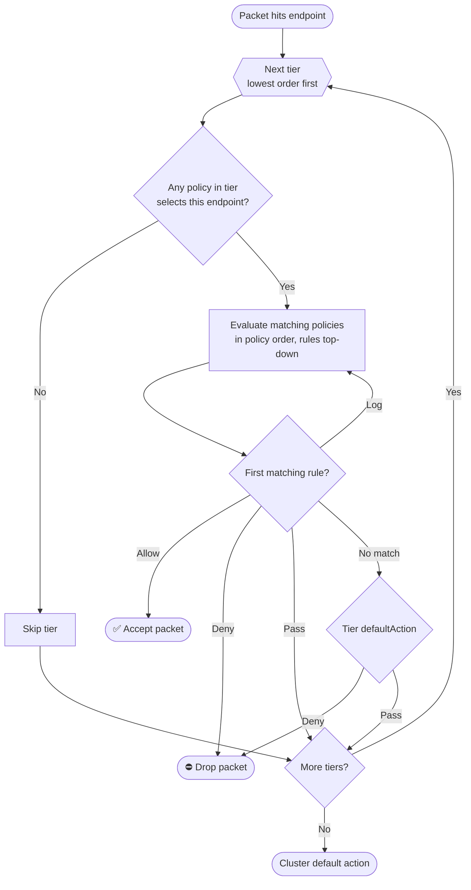

# **Thinking in Layers: Master Kubernetes Network Security with Tiered Policies**

Imagine a thriving production Kubernetes cluster. Dozens of microservices are deploying constantly, managed by multiple independent development teams. One morning, a well-meaning developer rolls out an updated application manifest. They copy-pasted a snippet that included a wide-open NetworkPolicy, accidentally opening a path from the public internet directly into your internal payment backend. Your security team’s hard-coded compliance rules were completely bypassed because a local manifest overrode global intent.

In the early days of Kubernetes, network policy enforcement felt a bit like the Wild West. You had a flat landscape of rules where any single "allow" flipped the switch for everyone. But as enterprise clusters scale, security cannot be left to a decentralized, flat model.

To survive multi-tenancy at scale, we have to start **thinking in layers**. Let’s explore how Kubernetes network security evolved from flat rules to structured, tiered policies using the new native Kubernetes APIs and Calico Tiers.

## **The Core Problem with Standard Kubernetes NetworkPolicy**

Standard Kubernetes NetworkPolicy resources are incredibly useful for basic application microsegmentation, but they have major architecture bottlenecks when scaled across an enterprise:

1. **The Namespace Jail:** Standard network policies are inherently scoped to a namespace. If your InfoSec team mandates a cluster-wide rule—such as blocking all internal pods from querying the cloud provider’s metadata API (169.254.169.254)—you have to copy-paste that policy into *every single namespace*. If a developer creates a new namespace tomorrow, that guardrail doesn't exist until someone manually applies it.
2. **The "Allow-Only" Restriction:** Standard policies cannot explicitly Deny traffic. They operate solely on an *allow-list* model. Isolation is implicit: if a pod is selected by a policy, any traffic not explicitly whitelisted is dropped. This makes it impossible to write a simple, top-level rule that says, *"Block traffic from Namespace X to Namespace Y, no matter what."*
3. **No Rules Hierarchy:** Kubernetes network policies are strictly additive. There are no weights, priorities, or order sequences. If Policy A (from your security team) implies traffic should be isolated, but Policy B (from a developer) explicitly allows it, the traffic flows.
4. **Organizational Friction:** Because anyone with namespace access can manipulate these policies, it sets up a direct conflict between the platform/security admins who need to enforce strict guardrails, and DevOps teams who just want their apps to talk to each other without opening a Jira ticket.

## **The Kubernetes Native Answer: ClusterNetworkPolicy**

Recognizing these scalability constraints, the Kubernetes Network Policy API Working Group developed a native solution, introducing ClusterNetworkPolicy.

This API completely shifts how cluster administrators manage traffic by adding three critical features:

* **Cluster-Scoped Control:** Unlike standard namespace-jailed policies, these resources apply across the entire cluster, providing a mechanism to enforce global guardrails automatically.
* **Explicit Actions:** Rules are no longer purely additive. You can now design rules with explicit Accept, Deny, and Pass actions.
* **Numeric Precedence:** Policies now feature explicit integer priorities. A policy with a lower integer value (e.g., 10\) takes precedence over a policy with a higher value (e.g., 100), allowing for deterministic evaluation.

This creates a native, layered approach to security. The cluster administrator sets the foundational rules at the top layer, and anything they choose not to explicitly lock down can bubble down to the standard application-level NetworkPolicy layers.

## **Industry-Grade Tiering: Calico Policy Tiers**

While the native Kubernetes APIs introduce a great two-layer system (Admin vs. Application), enterprise environments often require finer granularity. Project Calico expands on this concept by offering **Policy Tiers**—allowing you to design an arbitrary number of custom evaluation layers.

A Tier is its own Kubernetes resource (`tiers.projectcalico.org`), and every Calico `NetworkPolicy` and `GlobalNetworkPolicy` belongs to exactly one tier. If you don't specify one, the policy lands in the built-in **`default`** tier. This `default` tier is special: it always exists, it cannot be deleted, and it is pinned to the end of the evaluation pipeline. It is also where standard Kubernetes `NetworkPolicy` resources are enforced, which is what lets Calico tiers and native Kubernetes policies coexist in the same cluster.

Each Tier carries an `order` field (a float). Tiers are sorted and evaluated from the **lowest order value to the highest**, so a tier with `order: 100` is consulted before one with `order: 500`. The `default` tier behaves as though it has an effectively infinite order, guaranteeing it is always evaluated last.

A Tier also carries a `defaultAction` field that controls what happens to traffic that reaches the end of the tier without matching a rule. It can be set to either **`Deny`** (drop the traffic—the conventional behavior for a guardrail tier) or **`Pass`** (hand the traffic down to the next tier). This makes the end-of-tier behavior explicit and per-tier configurable rather than an implicit, baked-in default.

### **How Calico Evaluates a Packet**

When a packet enters or leaves a workload endpoint, Calico walks the pipeline top-down. Understanding this loop is the key to designing tiers that behave predictably:

1. **Iterate tiers in order.** Starting from the lowest-order tier, Calico looks at the policies in that tier whose selectors match the endpoint in question.
2. **Skip non-applicable tiers.** If *no* policy in a tier selects the endpoint, that tier is irrelevant to this packet—Calico moves straight to the next tier without dropping anything. A tier only "engages" for endpoints it actually targets.
3. **Evaluate matching policies in policy order.** Within an engaged tier, the selected policies are themselves sorted by their own `order` field. Calico evaluates each policy's ingress/egress rules from top to bottom.
4. **First matching rule wins.** The first rule whose match criteria fit the packet decides its fate:
   * **Allow** → the packet is accepted and evaluation stops immediately.
   * **Deny** → the packet is dropped and evaluation stops immediately.
   * **Pass** → Calico stops evaluating the *current tier* and jumps to the first matching policy in the *next* tier.
   * **Log** → the packet is logged and evaluation continues with the next rule (Log is non-terminating).
5. **End-of-tier default action.** If the endpoint was selected by at least one policy in the tier but no rule produced a terminal verdict, Calico applies the tier's configured `defaultAction`—either `Deny` (drop) or `Pass` (continue to the next tier).
6. **Fall through to the cluster default.** If the packet survives every tier without a terminal Allow/Deny—for example because the final tier's `defaultAction` is `Pass`—Calico falls back to the cluster's default action.

The diagram below traces a single packet through this pipeline. Tiers are evaluated from lowest order to highest; within each engaged tier, matching policies are checked in order until a rule produces a terminal verdict or the tier's `defaultAction` takes over:

### **The Magic of the Pass Action**

The secret weapon of tiered policies is the Pass action. If a rule matches traffic inside the security tier, but the security team wants to delegate the final connection decision to the platform or development teams, they can flag it as Pass.
This tells Calico: *"This traffic doesn't violate any critical global threat profiles. Skip the rest of the security tier and pass evaluation down to the next tier down the pipeline."*

Pass is what makes layering composable. The security tier can carve out the connections it cares about (deny the dangerous ones outright, Pass the rest) without having to know anything about the application-level rules that the platform and dev teams will write further down the chain. Crucially, Pass jumps to the **next tier**, not the next policy in the current tier—it short-circuits the remainder of the current tier entirely.

**The End-of-Tier Default Action:** It is crucial to understand what happens when a tier's policies match a specific pod endpoint but the packet doesn't match any explicit Allow, Deny, or Pass rule inside those policies. Rather than a hard-coded implicit deny, Calico applies the tier's configurable **`defaultAction`**, which you set to either `Deny` or `Pass`.

This is the single most important gotcha of tiered design: the moment *any* policy in a tier selects an endpoint, that tier becomes "authoritative" for it, and unmatched traffic meets the tier's `defaultAction`. With the conventional `Deny`, that traffic dies in the tier—it does **not** silently flow downward—so to intentionally let it continue you either add an explicit Pass rule or set the tier's `defaultAction` to `Pass`. Conversely, an endpoint that no policy in the tier selects is never subject to that tier's default action at all; the tier is simply skipped for it.

## **Practical Architecture: Designing Your Tiers**

To build a stable cluster defender layout, you shouldn't create a dozen chaotic tiers. The industry "gold standard" involves dividing ownership into three distinct buckets:

| Tier Name | Order | Owner | Core Responsibility | Example Use Case |
| :---- | :---- | :---- | :---- | :---- |
| **security** | 100 | Infosec Team | Global threat mitigation & absolute boundaries. | Block all log4j vectors; quarantine compromised namespaces; block cloud metadata APIs. |
| **platform** | 500 | Platform Eng | Infrastructure logging, metrics, and mesh stability. | Ensure Prometheus can scrape endpoints cluster-wide; allow standard CoreDNS egress. |
| **default** | 1,000,000 | App Developers | Microservice-to-microservice functional connectivity. | Allow frontend pod to communicate with backend pod on port 8080\. |

## **Operational Governance: Protecting the Tiers**

Creating layers is pointless if a developer can accidentally delete your security tier. To make tiered policies functional in production, you must back them up with rigid Kubernetes Role-Based Access Control (RBAC).
You should restrict access to the CRD endpoints so that only your Infosec team's CI/CD pipeline has access to write resources inside resourceNames: \["security"\]. Developers should only be granted access to the default tier or standard namespace-scoped NetworkPolicies.

Furthermore, always leverage a **Staging/Dry-Run Strategy** when tweaking high-priority tiers. Calico allows you to deploy policies in a Log or Staged configuration, letting you audit policy hits against live production traffic logs before turning on strict enforcement mode and accidentally dropping critical traffic.

## **Summary: Linear Traffic Control**

Transitioning from flat network policies to tiered architectures is the cloud-native equivalent of moving from a chaotic, single-file legacy firewall script to a clean, structured enterprise firewall zone layout.

By separating cluster security guardrails from application development agility, tiered policies deliver the best of both worlds: infosec compliance teams can sleep soundly knowing their boundaries cannot be bypassed, while application developers retain full control over their microservice configurations without bureaucracy.
